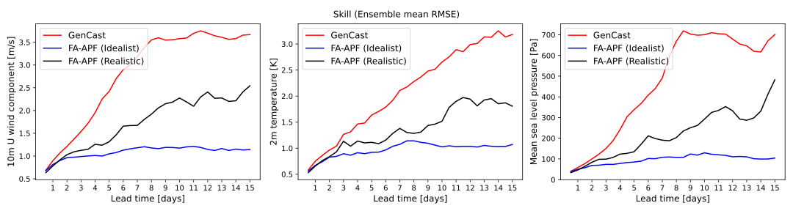

# [Training-Free Bayesian Filtering with Generative Emulators](https://arxiv.org/abs/2605.20028) 🌍

This repository contains the implementation of the GenCast experiment from the paper *Training-Free Bayesian Filtering with Generative Emulators* by Thomas Savary, François Rozet, and Gilles Louppe, published at the *International Conference on Machine Learning* (ICML) in 2026.

<p align="center">
        
</p>


### Code

The algorithm described in the paper is implemented in the `filtering` folder. In particular, it contains the following files:
- `filtering/wrapper/denoisers.py` that implements an [MMPS denoiser](https://azula.readthedocs.io/stable/api/azula.guidance.mmps.html) using the "basic" GenCast denoiser to draw samples from an approximation of the optimal proposal distribution $q(x_{k+1} \mid x^{k}, y^{k+1}) = p(x_{k+1} \mid x^{k}, y^{k+1})$.
- `filtering/fa_apf.py` that implements the [Fully Adapated Auxiliary Particle Filter (FA-APF)](https://ieeexplore.ieee.org/document/5947227) with covariance inflation to control the degeneracy of the weights.
  
To do other experiments, users can modify the configuration files in the `config` folder, as well as observations parameters (mask, covariance, ...) in the `data/observations` folder.

### Model and data

Our work build on [GenCast](https://arxiv.org/abs/2312.15796), a diffusion-based emulator of the atmosphere developed by Google. GenCast's denoisers were trained on [ERA5](https://www.ecmwf.int/en/forecasts/dataset/ecmwf-reanalysis-v5), a global atmospheric reanalysis dataset covering the period from 1940 to present and produced by the [ECMWF](https://www.ecmwf.int/) (the European Centre for Medium-Range Weather Forecasts).

### Citation

If you find this work useful in your research, please consider citing:
```bibtex
@inproceedings{
savary2026trainingfree,
title={Training-Free Bayesian Filtering with Generative Emulators},
author={Thomas Savary and Fran{\c{c}}ois Rozet and Gilles Louppe},
booktitle={Forty-third International Conference on Machine Learning},
year={2026},
url={https://openreview.net/forum?id=ibcZNZwKfZ}
}
```
