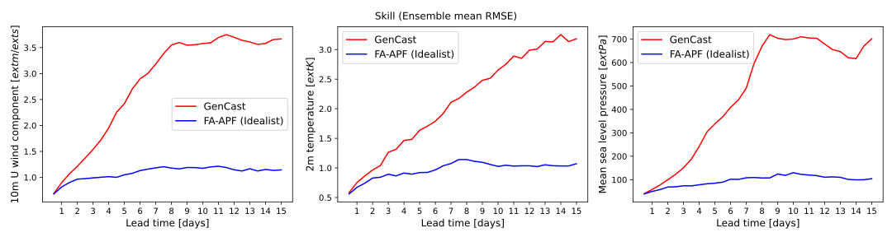

# [Training-Free Data Assimilation with GenCast](https://arxiv.org/abs/2509.18811) 🌍

This repository contains the code for the paper *Training-Free Data Assimilation with GenCast* by Thomas Savary, François Rozet and Gilles Louppe. 
The paper was published in 2025 in the *Tackling Climate Change with Machine Learning Workshop* at NeurIPS.

<p align="center">
        
</p>

### Code

The methods described in the paper are implemented in the `filtering` folder. In particular, it contains the following files:
- `filtering/wrapper/denoisers.py` that implements an [MMPS denoiser](https://azula.readthedocs.io/0.6.0/api/azula.guidance.mmps.html) using the "basic" GenCast denoiser to draw samples from the optimal proposal distribution $q(x_{k+1} \mid x^{k}, y^{k+1}) = p(x_{k+1} \mid x^{k}, y^{k+1})$.
- `filtering/fa_apf.py` that implements the [Fully Adapated Auxiliary Particle Filter (FA-APF)](https://ieeexplore.ieee.org/document/5947227) with covariance inflation to control the degeneracy of the weights.
  
To do other experiments, users can modify the configuration files in the `config` folder, as well as observations parameters (mask, covariance, ...) in the `data/observations` folder.

### Model and data

Our work build on [GenCast](https://arxiv.org/abs/2312.15796), a diffusion-based emulator of the atmosphere developed by Google. GenCast's denoisers were trained on [ERA5](https://www.ecmwf.int/en/forecasts/dataset/ecmwf-reanalysis-v5), a global atmospheric reanalysis dataset covering  the period from 1940 to present and produced by the ECMWF (the European Centre for Medium-Range Weather Forecasts).

### Citation

If you find this work useful in your research, please consider citing:
```bibtex
@misc{savary2025trainingfreedataassimilationgencast,
      title={Training-Free Data Assimilation with GenCast}, 
      author={Thomas Savary and François Rozet and Gilles Louppe},
      year={2025},
      eprint={2509.18811},
      archivePrefix={arXiv},
      primaryClass={cs.LG},
      url={https://arxiv.org/abs/2509.18811}, 
}
```
